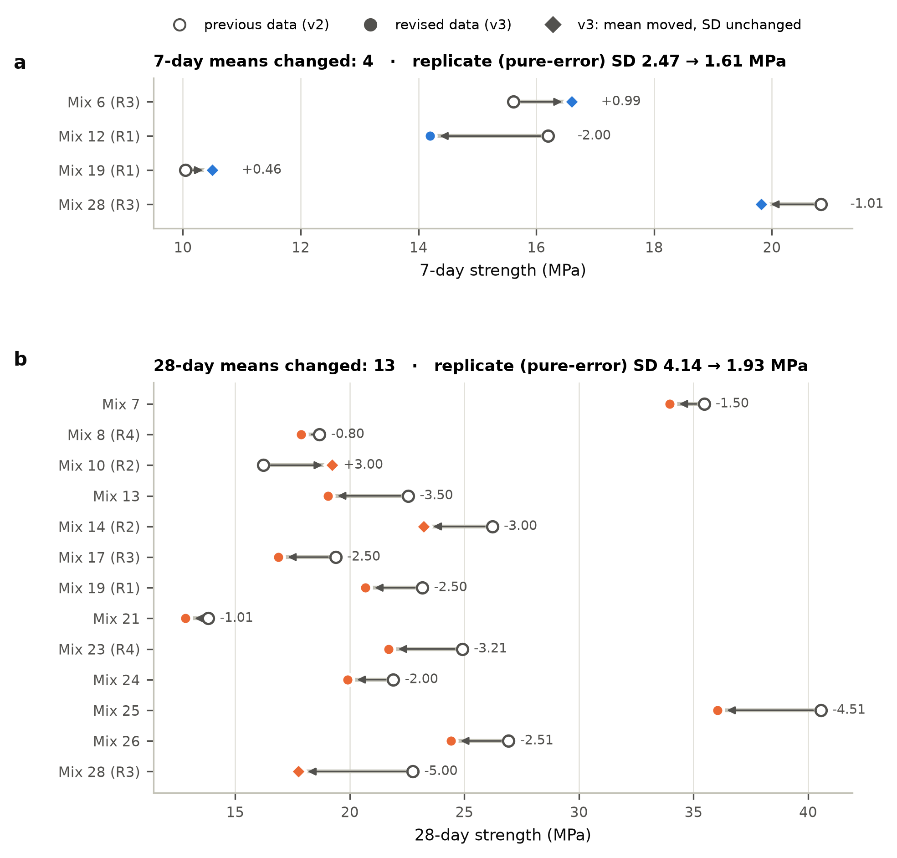
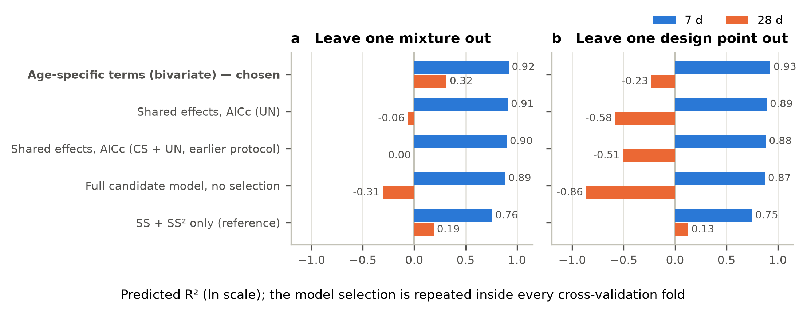
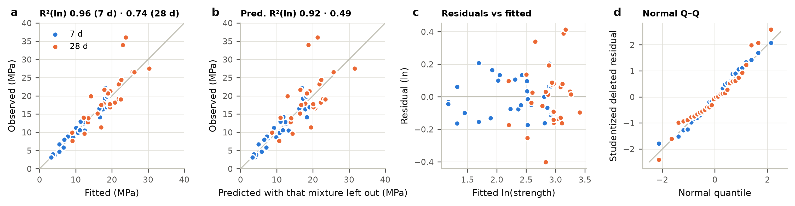
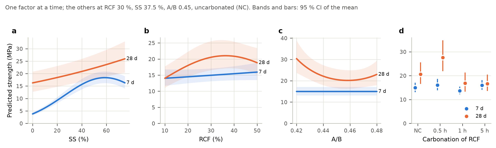
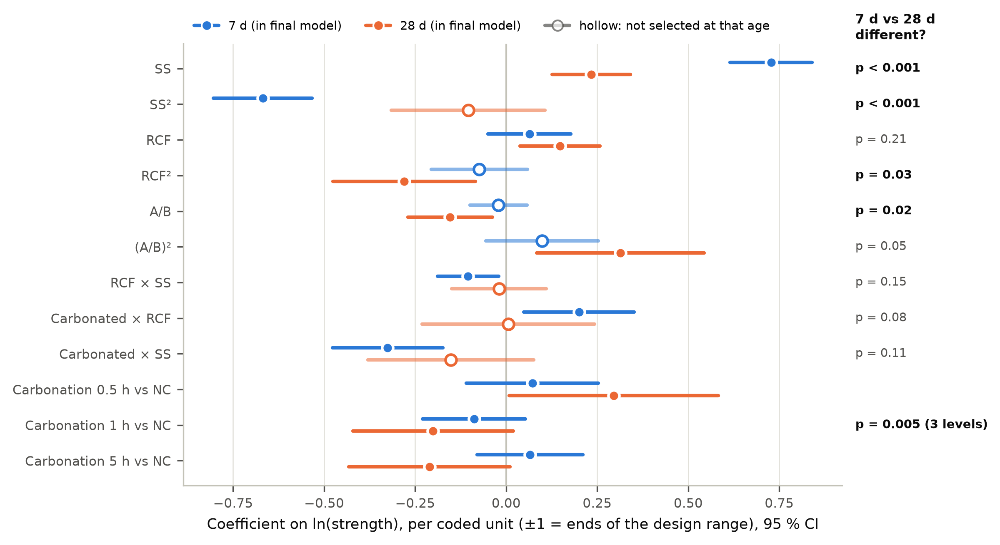
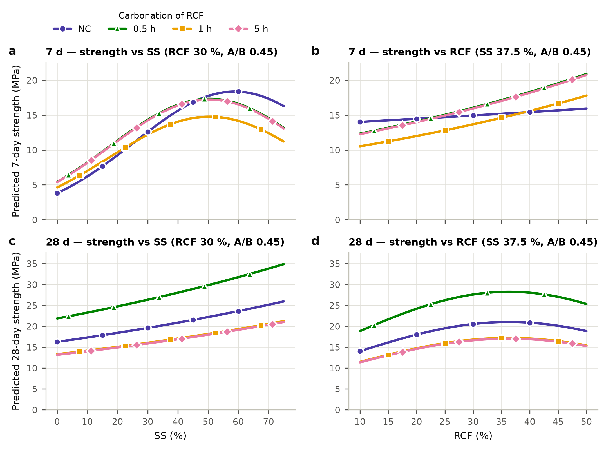
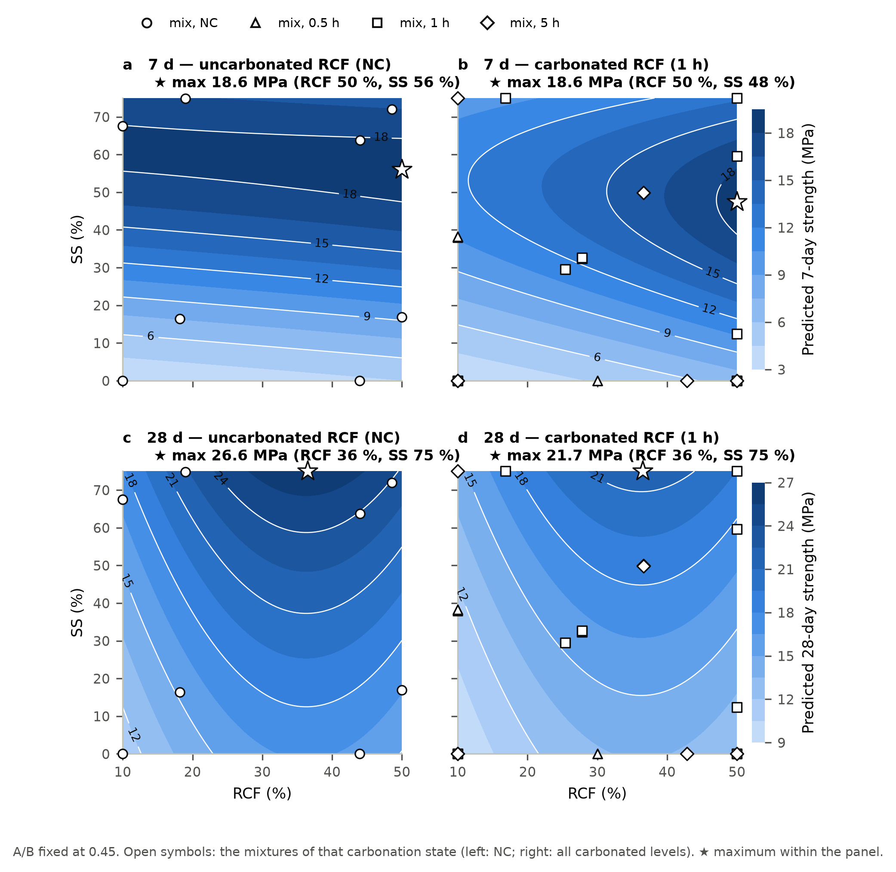
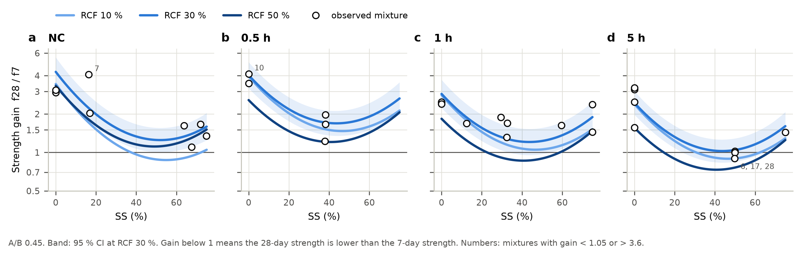
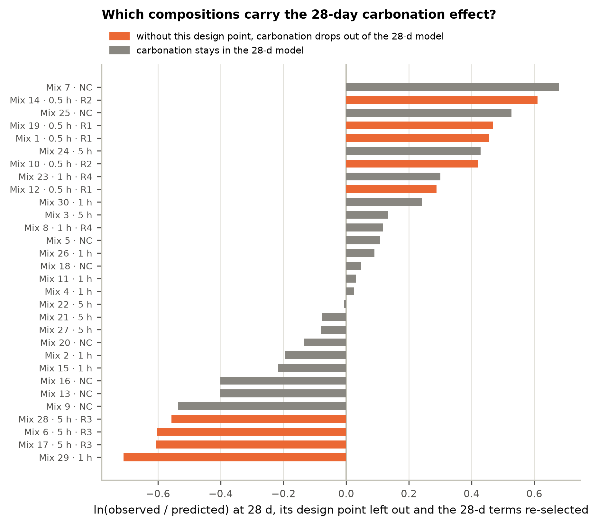

# Compressive strength at 7 and 28 days — model of the revised data (v3)

*Generated 2026-10-02 by `analysis/report_v3.py` from `results/v3/v3_results.json`; every number below is read from the analysis output. Data: `data/strength_7d_28d_v3_noiseless.csv` (30 mixtures, mean strengths; standard deviations not used).*

## Answers in brief

1. **Use one bivariate model for both ages.** Each curing age has its own regression equation with its own terms, and the two equations are estimated together, with the 7- and 28-day results of a mixture treated as a correlated pair (correlation 0.44). It is one model that predicts both ages, it handles the pairing correctly, and it lets the effect of every parameter differ between 7 and 28 days. The common alternative — one equation with age as a factor and the mixture effects shared by both ages — forces the 7-day effects onto 28 days: AICc prefers the bivariate model by 4.8, and in cross-validation the shared model predicts 28-day strength worse than SS alone (predicted R² −0.06 vs 0.19; bivariate model 0.32).
2. **7-day strength** is described to within replicate precision (R² 0.96, predicted R² 0.92, lack of fit p = 0.66). It is governed by SS, with a maximum near SS 59 % (uncarbonated RCF) or 50 % (carbonated RCF), and by three interactions: a higher RCF dosage raises strength more when the RCF is carbonated, carbonation helps at low SS and hurts at high SS, and RCF helps more at low SS. A/B has no effect at 7 days.
3. **28-day strength** is described less well (R² 0.74, predicted R² 0.49, lack of fit p = 0.02). SS still raises it, but much less and without a maximum (×1.59 from SS 0 to 75 %); RCF has a maximum near 36 %; A/B 0.42 gives ×1.48 the strength of A/B 0.45; carbonation for 0.5 h gives ×1.34, 1 h ×0.82 and 5 h ×0.81 the strength of uncarbonated RCF. No interaction is detectable at 28 days.
4. **What changes between 7 and 28 days** (tests of equal effect at both ages): SS (p < 0.001), its curvature (p < 0.001), carbonation (p = 0.005), A/B (p = 0.02) and the RCF curvature (p = 0.03). The three 7-day interactions are not detectable at 28 days, but the data cannot show that they vanish (p = 0.08–0.15 for a difference).
5. **Strength gain f28/f7** is largest without silicate (×4.3 at SS 0 %, NC, RCF 30 %) and smallest near SS 41–55 % (×1.37 at SS 37.5 %); carbonation and RCF modify it. The 5 h mixtures at SS ≈ 50 % (mixes 6, 17, 28) gained no strength after 7 days.
6. **How firm is each conclusion?** Every 7-day conclusion is robust (the same model is selected in all 30 leave-one-out refits). At 28 days the SS effect, the RCF maximum and the benefit of low A/B are robust. The carbonation differences rest on three compositions (two at 0.5 h, one at 5 h) and the A/B curvature on one of them: leave any of these out and the selection drops carbonation from the 28-day model and the affected effect is no longer significant. Report them as indications, not established effects (Section 8).
7. **The data revision needs documenting before publication.** 17 means changed relative to the previous data set; several changes cannot come from removing noisy specimens (Section 1). The revision does not reverse any effect, but it is what makes the 28-day carbonation and A/B-curvature terms selectable (Akaike weights 0.16 and 0.22 with the previous values, 0.73 and 0.71 with the revised ones).

## 1  Data and the revision (v2 → v3)

The revised table (`data/source/30_mixes_strength_results_noiseless.pdf`, transcribed programmatically to `data/strength_7d_28d_v3_noiseless.csv`) has the same 30 mixtures and the same mixture variables as the previous data set (`data/strength_7d_28d_corrected.csv`, v2). 23 entries differ: 17 means (4 at 7 days, 13 at 28 days) and 6 last-digit changes of 0.01 MPa. Every change is listed in `results/v3/tables/V00_revision_log_v2_to_v3.csv`.

> **Before publishing: document every revised value**
>
> Several of the changes are not what removing noisy specimens produces:
>
> * **6 means moved while their standard deviation stayed identical**, among them at 28 days mix 10 by +3.00 MPa, mix 14 by −3.00 MPa, mix 28 by −5.00 MPa. With three specimens, a mean can move with an unchanged SD only if every specimen moved by the same amount; excluding or re-testing a specimen changes the SD.
> * **11 SDs increased and none decreased.** Removing noisy specimens normally lowers the SD.
> * **Replicate batches moved toward each other.** Mixes 10 and 14 (identical composition) moved by exactly 3.00 MPa each toward one another, and 9 of the 11 changed replicate means moved toward their group. The replicate (pure-error) SD fell from 4.14 to 1.93 MPa at 28 days and from 2.47 to 1.61 MPa at 7 days.
>
> There can be legitimate reasons — a corrected specimen area, a load-cell zero offset on one test day, transcription errors in the earlier table. But a reviewer or co-author comparing the versions will ask, so each change needs a reason traceable to the raw specimen records. If a value was moved toward an expected or replicate value rather than recomputed from specimens, it cannot be reported as a measurement; the measured values must be used. Section 8 shows which conclusions depend on the revision.

*Means that changed by more than 0.01 MPa*

| Mix | Age | Replicate group | v2 mean ± SD | v3 mean ± SD | Change (MPa) | Kind |
|---|---|---|---|---|---|---|
| 6 | 7 d | R3 | 15.61 ± 1.05 | 16.60 ± 1.05 | +0.99 | mean shifted, SD unchanged |
| 12 | 7 d | R1 | 16.20 ± 2.60 | 14.20 ± 4.72 | −2.00 | mean shifted, SD increased |
| 19 | 7 d | R1 | 10.04 ± 0.61 | 10.50 ± 0.61 | +0.46 | mean shifted, SD unchanged |
| 28 | 7 d | R3 | 20.83 ± 1.49 | 19.82 ± 1.49 | −1.01 | mean shifted, SD unchanged |
| 7 | 28 d | – | 35.46 ± 3.23 | 33.96 ± 5.35 | −1.50 | mean shifted, SD increased |
| 8 | 28 d | R4 | 18.68 ± 2.26 | 17.88 ± 6.50 | −0.80 | mean shifted, SD increased |
| 10 | 28 d | R2 | 16.22 ± 2.65 | 19.22 ± 2.65 | +3.00 | mean shifted, SD unchanged |
| 13 | 28 d | – | 22.55 ± 2.94 | 19.05 ± 7.89 | −3.50 | mean shifted, SD increased |
| 14 | 28 d | R2 | 26.22 ± 0.29 | 23.22 ± 0.29 | −3.00 | mean shifted, SD unchanged |
| 17 | 28 d | R3 | 19.38 ± 0.95 | 16.88 ± 4.48 | −2.50 | mean shifted, SD increased |
| 19 | 28 d | R1 | 23.17 ± 3.69 | 20.67 ± 7.23 | −2.50 | mean shifted, SD increased |
| 21 | 28 d | – | 13.83 ± 2.69 | 12.82 ± 4.11 | −1.01 | mean shifted, SD increased |
| 23 | 28 d | R4 | 24.91 ± 2.30 | 21.70 ± 3.71 | −3.21 | mean shifted, SD increased |
| 24 | 28 d | – | 21.90 ± 1.57 | 19.90 ± 4.40 | −2.00 | mean shifted, SD increased |
| 25 | 28 d | – | 40.55 ± 6.36 | 36.04 ± 12.72 | −4.51 | mean shifted, SD increased |
| 26 | 28 d | – | 26.93 ± 3.12 | 24.42 ± 6.65 | −2.51 | mean shifted, SD increased |
| 28 | 28 d | R3 | 22.75 ± 2.12 | 17.75 ± 2.12 | −5.00 | mean shifted, SD unchanged |



*Figure 1 — Every mean that changed between the previous (v2) and the revised (v3) data. Diamonds: the mean moved while the SD stayed the same.*

## 2  One model for both ages, or one per age?

The 7- and 28-day results of a mixture come from the same batch, so they are a correlated pair. There are three ways to model them:

* **Separate models, one per age.** Valid, and each age gets its own terms. But the two models know nothing of each other, so they cannot test whether an effect differs between 7 and 28 days or give a confidence interval for the strength gain.
* **One equation with curing age as a factor and shared effects** (the earlier paired model): each mixture effect is the same at both ages unless an age × effect interaction is selected. Efficient when the effects really are shared; misleading when they are not.
* **One bivariate model with age-specific terms** (chosen): one equation per age, each with its own terms, estimated together with an unstructured covariance for the 7/28-day pair (seemingly unrelated regressions; equivalently a linear mixed model with age-specific fixed effects and an unstructured within-mixture covariance). Both alternatives are special cases of it — separate models drop the correlation, the shared-effects model forces equal coefficients — so it can be compared with both on the same likelihood, and Section 4 tests which effects differ between the ages.

On the revised data the bivariate model is better by every criterion. On the same joint likelihood, AICc prefers it to the best shared-effects model by 4.8 and to the same terms with the pairing ignored by 1.5. In nested cross-validation (the whole model selection repeated in every fold) it predicts 7-day strength as well as the shared-effects model and 28-day strength much better:

*Nested cross-validation, ln scale. LOMO: leave one mixture out; LODPO: leave one design point out (all replicate batches of a composition together)*

| Procedure | Pred. R² 7 d (LOMO) | Pred. R² 28 d (LOMO) | RMSE 7 / 28 d (MPa, LOMO) | Pred. R² 7 d (LODPO) | Pred. R² 28 d (LODPO) |
|---|---|---|---|---|---|
| **Bivariate, age-specific terms (chosen)** | 0.92 | 0.32 | 1.9 / 5.6 | 0.93 | −0.23 |
| Shared effects, AICc (UN) | 0.91 | −0.06 | 2.0 / 7.4 | 0.89 | −0.58 |
| Shared effects, AICc (CS + UN; earlier protocol) | 0.90 | 0.00 | 2.0 / 7.2 | 0.88 | −0.51 |
| Full candidate model, no selection | 0.89 | −0.31 | 2.2 / 8.6 | 0.87 | −0.86 |
| SS + SS² only (reference) | 0.76 | 0.19 | 2.6 / 6.1 | 0.75 | 0.13 |



*Figure 2 — Predicted R² of each modelling procedure under nested cross-validation.*

Leaving out whole design points is the stricter test, because replicate batches of the held-out composition can no longer help. Under it the 7-day model still predicts new compositions very well (predicted R² 0.93), but no procedure predicts the 28-day strength of a new composition reliably (bivariate −0.23, shared effects −0.58, SS alone 0.13). The reason is that the 28-day carbonation effect is carried by three compositions (Section 8).

## 3  The final model

Response: ln(strength) (Box–Cox λ = 0.04, 95 % CI −0.26 to 0.34, for both ages together; λ = 1, the raw MPa scale, is rejected at both ages: LR 18.3 at 7 d, 11.2 at 28 d). Coded variables: A = (RCF − 30)/20, C = (A/B − 0.45)/0.03, D = (SS − 37.5)/37.5, so −1 and +1 are the ends of the design range. Carbonation enters as a four-level factor (NC, 0.5 h, 1 h, 5 h); its interactions with the mixture variables use K = 1 for carbonated RCF, because the 0.5 h level has only two distinct compositions. Terms per age: exhaustive AICc search over all 716 hierarchical models of the full quadratic candidate set.

```
ln f7  = 2.7048 + 0.0640·A + 0.7274·D + 0.0717·[0.5 h] − 0.0884·[1 h] + 0.0653·[5 h] − 0.0993·A·D − 0.6412·D² + 0.1987·K·A − 0.2847·K·D
ln f28 = 3.0227 + 0.1477·A − 0.1399·C + 0.2334·D + 0.2954·[0.5 h] − 0.2010·[1 h] − 0.2106·[5 h] − 0.2341·A² + 0.2515·C²

A = (RCF − 30)/20, C = (A/B − 0.45)/0.03, D = (SS − 37.5)/37.5; [0.5 h], [1 h], [5 h] = 1 for that carbonation
level (all 0 for NC); K = 1 for carbonated RCF (any duration).
Residual SD (ln): 0.137 at 7 d, 0.210 at 28 d; correlation of the 7/28-day pair 0.44.
```

In actual units (RCF and SS in %, A/B as a ratio; C[·] = 1 for that carbonation level, K = 1 for any carbonated RCF):

```
ln(f7)  = 1.09123 + 0.00816846·RCF + 0.057565·SS − 0.000132455·RCF·SS − 0.000455931·SS² + 0.058344·C[0.5 h] − 0.101748·C[1 h] + 0.0520049·C[5 h] + 0.00993432·K·RCF − 0.00759159·K·SS
ln(f28) = 60.7297 + 0.0425003·RCF + 0.00622331·SS − 256.174·A/B − 0.000585259·RCF² + 279.455·(A/B)² + 0.29544·C[0.5 h] − 0.200976·C[1 h] − 0.210559·C[5 h]
ln(f28/f7) = 59.6385 + 0.0343318·RCF − 0.0513417·SS − 256.174·A/B + 0.000132455·RCF·SS − 0.000585259·RCF² + 0.000455931·SS² + 279.455·(A/B)² + 0.237096·C[0.5 h] − 0.0992281·C[1 h] − 0.262564·C[5 h] − 0.00993432·K·RCF + 0.00759159·K·SS

The 28-day RCF and A/B terms in vertex form: −0.000585259·(RCF − 36.3)² and +279.455·(A/B − 0.4583)²,
i.e. a maximum at RCF ≈ 36 % and a minimum at A/B ≈ 0.458. Keep all digits of the A/B coefficients; they nearly cancel.
```

Strength in MPa is exp(·) of these expressions (the median of a new batch). Term tests (Wald F, Satterthwaite df):

*Final model: term tests and how often the term is re-selected when the data are resampled*

| Age | Term | df | F | p | Selected, residual bootstrap | Selected, subsamples 24/30 |
|---|---|---|---|---|---|---|
| 7 d | RCF | 1, 21.4 | 1.36 | 0.26 | 100% | 100% |
| 7 d | SS | 1, 21.5 | 178.56 | < 0.001 | 100% | 100% |
| 7 d | Carb | 3, 20.5 | 2.01 | 0.14 | 88% | 51% |
| 7 d | RCF·SS | 1, 18.7 | 7.53 | 0.01 | 71% | 60% |
| 7 d | SS² | 1, 19.3 | 116.44 | < 0.001 | 100% | 100% |
| 7 d | K·RCF | 1, 18.9 | 9.20 | 0.007 | 72% | 37% |
| 7 d | K·SS | 1, 19.2 | 18.42 | < 0.001 | 87% | 50% |
| 28 d | RCF | 1, 21.2 | 7.78 | 0.01 | 89% | 55% |
| 28 d | A/B | 1, 19.7 | 7.79 | 0.01 | 86% | 70% |
| 28 d | SS | 1, 20.9 | 20.25 | < 0.001 | 100% | 99% |
| 28 d | Carb | 3, 21.6 | 5.55 | 0.006 | 74% | 29% |
| 28 d | RCF² | 1, 20.2 | 7.51 | 0.01 | 68% | 40% |
| 28 d | (A/B)² | 1, 20.1 | 6.31 | 0.02 | 54% | 22% |

*Coefficients of the final model (ln scale, coded units)*

| Age | Term | Coded column | Estimate | SE | 95 % CI | p |
|---|---|---|---|---|---|---|
| 7 d | Intercept | Intercept | 2.7048 | 0.0639 | 2.572 to 2.837 | < 0.001 |
| 7 d | RCF | A | 0.0640 | 0.0548 | −0.050 to 0.178 | 0.26 |
| 7 d | SS | D | 0.7274 | 0.0544 | 0.614 to 0.840 | < 0.001 |
| 7 d | Carbonation [0.5 h] | Carb[0.5 h] | 0.0717 | 0.0873 | −0.110 to 0.253 | 0.42 |
| 7 d | Carbonation [1 h] | Carb[1 h] | −0.0884 | 0.0680 | −0.230 to 0.053 | 0.21 |
| 7 d | Carbonation [5 h] | Carb[5 h] | 0.0653 | 0.0696 | −0.080 to 0.210 | 0.36 |
| 7 d | RCF·SS | AD | −0.0993 | 0.0362 | −0.175 to −0.024 | 0.01 |
| 7 d | SS² | D2 | −0.6412 | 0.0594 | −0.765 to −0.517 | < 0.001 |
| 7 d | K·RCF | KA | 0.1987 | 0.0655 | 0.062 to 0.336 | 0.007 |
| 7 d | K·SS | KD | −0.2847 | 0.0663 | −0.423 to −0.146 | < 0.001 |
| 28 d | Intercept | Intercept | 3.0227 | 0.1052 | 2.805 to 3.240 | < 0.001 |
| 28 d | RCF | A | 0.1477 | 0.0530 | 0.038 to 0.258 | 0.01 |
| 28 d | A/B | C | −0.1399 | 0.0501 | −0.245 to −0.035 | 0.01 |
| 28 d | SS | D | 0.2334 | 0.0519 | 0.125 to 0.341 | < 0.001 |
| 28 d | Carbonation [0.5 h] | Carb[0.5 h] | 0.2954 | 0.1385 | 0.008 to 0.583 | 0.04 |
| 28 d | Carbonation [1 h] | Carb[1 h] | −0.2010 | 0.1061 | −0.421 to 0.019 | 0.07 |
| 28 d | Carbonation [5 h] | Carb[5 h] | −0.2106 | 0.1065 | −0.432 to 0.011 | 0.06 |
| 28 d | RCF² | A2 | −0.2341 | 0.0854 | −0.412 to −0.056 | 0.01 |
| 28 d | (A/B)² | C2 | 0.2515 | 0.1001 | 0.043 to 0.460 | 0.02 |

Fit and validation:

*Fit statistics per age (predicted R² with the final terms fixed; the nested values are in Section 2)*

| Statistic | 7 d | 28 d |
|---|---|---|
| Coefficients | 10 | 9 |
| R² (ln) / adjusted R² | 0.96 / 0.94 | 0.74 / 0.64 |
| Predicted R² (ln), leave one mixture out | 0.92 | 0.49 |
| Predicted R² (ln), leave one design point out | 0.93 | 0.39 |
| RMSE fitted / predicted (MPa) | 1.4 / 1.9 | 3.8 / 5.1 |
| Residual SD (ln) ≈ CV | 0.137 | 0.210 |
| Replicate (pure-error) SD (ln) | 0.148 | 0.097 |
| Lack of fit F (df), p | 0.79 (14, 6), 0.66 | 6.06 (15, 6), 0.02 |
| Adequate precision (> 4 is adequate) | 23.0 | 10.9 |
| Shapiro–Wilk p / Breusch–Pagan p | 0.84 / 0.74 | 0.38 / 0.99 |
| Largest studentized residual (Bonferroni p) | 2.07, mix 14 (1.00) | 2.58, mix 25 (0.54) |
| Largest Cook's distance | 0.18 (mix 13) | 0.24 (mix 7) |



*Figure 3 — Observed vs fitted and vs left-out predictions, residuals and normal Q–Q plot.*

At 7 days the residual scatter equals the replicate scatter, so the model explains everything the mixture variables can. At 28 days the residual scatter is about twice the (revised) replicate scatter, so 28-day strength varies between compositions for reasons the four variables do not capture. No single result is an outlier (largest Bonferroni p 0.54).

## 4  How strength responds to each parameter



*Figure 4 — One factor at a time, the others at RCF 30 %, SS 37.5 %, A/B 0.45 and NC.*



*Figure 5 — Every effect at 7 and at 28 days, with the test of whether it differs between the ages. Hollow: the term was not selected at that age (estimated here only for the comparison).*

* **Silicate share SS** is the dominant factor at 7 days: from SS 0 to the maximum at SS 59 % the strength rises ×4.8 (NC, RCF 30 %). The maximum lies at 56–62 % for uncarbonated and 48–53 % for carbonated RCF (lower at higher RCF). At 28 days the effect is weaker, ×1.59 from SS 0 to 75 %, and has no maximum within the design range (SS² at 28 d: Akaike weight 0.20).
* **RCF dosage** at 7 days depends on carbonation and SS (next section). At 28 days it has a maximum near RCF 36 %; RCF 50 % gives ×1.34 the strength of RCF 10 % (95 % CI 1.08–1.67).
* **A/B** (0.42–0.48) has no effect at 7 days (added-term p = 0.57). At 28 days A/B 0.42 gives ×1.48 (95 % CI 1.17–1.87) the strength of A/B 0.45; A/B 0.48 gives ×1.12 (0.89–1.41, p = 0.33). The fitted curve has its minimum at A/B ≈ 0.458; the rise toward 0.48 is the least certain part (Section 8).
* **Carbonation duration**: at 7 days the three durations hardly differ (p = 0.07); what matters is carbonated versus not, through the interactions. At 28 days the durations differ (p = 0.003): 0.5 h ×1.34 (1.01–1.79), 1 h ×0.82 (0.66–1.02), 5 h ×0.81 (0.65–1.01) relative to NC, the same at every composition.

## 5  Interactions



*Figure 6 — Strength vs SS and vs RCF for each carbonation level, at 7 days (top) and 28 days (bottom). Non-parallel curves are interactions.*

At 7 days three interactions are supported (all three re-selected in all 30 leave-one-out refits):

* **Carbonation × SS** (p < 0.001): carbonated RCF raises 7-day strength in silicate-poor mixes and lowers it in silicate-rich ones. Carbonated (1 h) vs NC: ×1.48 (1.18–1.87) at RCF 50 %, SS 0 %, but ×0.56 (0.44–0.72) at RCF 10 %, SS 75 %.
* **Carbonation × RCF** (p = 0.007): carbonated RCF is the more reactive filler. At SS 0 %, raising RCF from 10 to 50 % gives ×2.06 (1.69–2.52) when it is carbonated and ×1.39 (1.06–1.82) when it is not.
* **RCF × SS** (p = 0.01): RCF helps most when SS is low. Uncarbonated RCF 50 vs 10 %: ×1.39 at SS 0 %, ×1.14 at 37.5 % (p = 0.26) and ×0.93 at 75 % (p = 0.60); carbonated: ×2.06, ×1.69 and ×1.39.

At 28 days none of these interactions improves the model (added-term tests: carbonation × SS p = 0.18, carbonation × RCF p = 0.96, RCF × SS p = 0.76; every other added term p ≥ 0.18). On the ln scale the 28-day effects are additive, i.e. each factor multiplies strength by the same factor whatever the others are. Whether the 7-day interactions truly fade by 28 days or are only masked by the larger 28-day scatter cannot be decided from these data (tests of a difference: p = 0.08, 0.11, 0.15).



*Figure 7 — Predicted strength over RCF and SS for uncarbonated and carbonated (1 h) RCF at A/B 0.45.*

## 6  Strength gain from 7 to 28 days



*Figure 8 — Gain f28/f7 vs SS for each carbonation level and three RCF dosages, with the observed gains.*

Because SS raises 7-day strength much more than 28-day strength, the gain falls steeply from SS 0 % to a minimum near SS 41–55 % (depending on RCF and carbonation) and rises slightly beyond: ×4.28 (95 % CI 3.30–5.54) at SS 0 %, ×1.37 (1.10–1.72) at SS 37.5 % and ×1.59 (1.25–2.03) at SS 75 % (NC, RCF 30 %, A/B 0.45). Carbonation and RCF modify it: carbonated RCF, which boosts early strength, gains less later, most of all after 5 h of carbonation (5 h, RCF 50 %, SS 37.5 %: ×0.74, 0.58–0.93). The observed 5 h mixtures at SS ≈ 50 % (mixes 6, 17, 28) have gains of 0.90–1.02.

## 7  Strongest mixes within the design range

*Maximum predicted strength per age and carbonation level*

| Age | Carbonation | RCF % | SS % | A/B | Median (MPa) | 95 % CI | 95 % PI (one batch) | Within 5 % of the maximum | Distance to nearest tested mix (coded) |
|---|---|---|---|---|---|---|---|---|---|
| 7 d | NC | 50 | 56 | any (no effect) | 18.6 | 15.7–22.0 | 13.4–25.9 | RCF 10–50, SS 46–70 | 0.51 |
| 7 d | 0.5 h | 50 | 48 | any (no effect) | 21.9 | 17.8–26.9 | 15.4–31.1 | RCF 46–50, SS 37–58 | 1.91 |
| 7 d | 1 h | 50 | 48 | any (no effect) | 18.6 | 16.3–21.3 | 13.6–25.5 | RCF 46–50, SS 37–58 | 0.31 |
| 7 d | 5 h | 50 | 48 | any (no effect) | 21.7 | 18.5–25.5 | 15.7–30.1 | RCF 46–50, SS 37–58 | 0.99 |
| 28 d | NC | 36 | 75 | 0.42 | 39.3 | 30.3–51.0 | 23.7–65.2 | RCF 27–45, SS 67–75 | 0.69 |
| 28 d | 0.5 h | 36 | 75 | 0.42 | 52.8 | 36.4–76.6 | 29.8–93.5 | RCF 27–45, SS 67–75 | 1.88 |
| 28 d | 1 h | 36 | 75 | 0.42 | 32.1 | 25.6–40.4 | 19.7–52.5 | RCF 27–45, SS 67–75 | 0.81 |
| 28 d | 5 h | 36 | 75 | 0.42 | 31.8 | 24.2–41.9 | 19.0–53.2 | RCF 27–45, SS 67–75 | 0.99 |

Every 28-day maximum lies on the edge of the design range (SS 75 %, A/B 0.42), because SS and low A/B keep raising 28-day strength up to the boundary; these are extrapolation-prone. The 0.5 h optimum is furthest from any tested 0.5 h mixture (the 0.5 h level was tested at only two compositions, both at A/B 0.45 and SS ≤ 38 %), so its 28-day value of 53 MPa is a hypothesis to test, not a prediction to rely on. The 7-day maxima sit inside or close to tested mixtures.

## 8  How firm is each conclusion?



*Figure 9 — 28-day prediction error of each mixture when its whole design point is left out and the 28-day terms re-selected. Orange: without this design point, carbonation drops out of the 28-day model.*

The 28-day carbonation effect is carried by three compositions: the two 0.5 h compositions (replicate groups R1 and R2) and the 5 h composition at SS ≈ 50 % (R3), plus the single-specimen mix 29. Without R1 the carbonation test at 28 days gives p = 0.06 and the 0.5 h effect ×1.26 (p = 0.28); without R3 the 5 h effect is ×0.93 (p = 0.57) and the A/B curvature p = 0.14. The benefit of low A/B survives every exclusion (A/B 0.42 vs 0.45: ×1.41–1.50, p ≤ 0.01).

| Conclusion | Evidence | Status |
|---|---|---|
| SS raises strength, with a maximum at 7 d | p < 0.001; selected in 100 % of resamples | Robust |
| SS effect much weaker at 28 d (gain falls with SS) | difference p < 0.001 | Robust |
| Carbonation × SS, carbonation × RCF, RCF × SS at 7 d | p < 0.001, p = 0.007, p = 0.01; residual bootstrap 87%, 72%, 71%; 30/30 leave-one-out | Robust |
| A/B has no effect at 7 d | added-term p = 0.57 | Robust |
| Lower A/B raises 28-d strength | p = 0.002; survives every replicate-group exclusion | Robust |
| RCF maximum near 36 % at 28 d | RCF² p = 0.01; residual bootstrap 68% | Moderate |
| Carbonation durations differ at 28 d (0.5 h up, 1 h and 5 h down) | p = 0.006; residual bootstrap 74%, subsamples 29%; rests on R1, R2, R3 | Indication |
| A/B curvature (minimum near 0.46) at 28 d | p = 0.02; residual bootstrap 54%; rests on R3 | Indication |
| The 7-d interactions vanish by 28 d | differences p = 0.08–0.15 | Not shown |

**Dependence on the data revision.** With the previous values (v2) the same protocol selects the same 7-day model and a simpler 28-day model (RCF, A/B, SS, RCF²). Fitting the revised model's terms to the v2 values gives effects of the same direction and similar size:

| Quantity (28 d unless stated) | Revised data (v3) | Previous data (v2), same terms |
|---|---|---|
| 0.5 h / NC | 1.34 | 1.29 |
| 1 h / NC | 0.82 | 0.81 |
| 5 h / NC | 0.81 | 0.83 |
| A/B 0.42 / 0.45 | 1.48 | 1.45 |
| Gain f28/f7 at SS 0 % (NC, RCF 30 %) | 4.28 | 4.63 |
| Gain f28/f7 at SS 75 % | 1.59 | 1.80 |
| R² (ln) 7 d / 28 d | 0.96 / 0.74 | 0.95 / 0.70 |

So the revision does not create or reverse an effect; it lowers the 28-day scatter enough for AICc to select the carbonation and A/B-curvature terms (Akaike weights 0.16 → 0.73 and 0.22 → 0.71). Other checks: the raw MPa scale fits worse (predicted R² in MPa 0.82 / 0.33 vs 0.87 / 0.38 for the ln model); coding carbonation as carbonated yes/no removes it from the 28-day model (AICc 16.0 vs 12.1), i.e. the 28-day pattern is 0.5 h vs longer carbonation, not carbonated vs uncarbonated; with mix 7 (largest Cook's distance at 28 d) removed, the 28-day model adds carbonation × SS and the carbonation ratios become 0.5 h ×1.45, 1 h ×0.91, 5 h ×0.88.

## 9  Limitations and next experiments

* 28-day strength varies between compositions about twice as much as between replicate batches (lack of fit p = 0.02). The residual scatter alone gives ×/÷ 1.5 for one new batch at 28 days, against ×/÷ 1.3 at 7 days; the prediction intervals in Section 7 are wider still.
* Carbonation level is confounded with composition at 28 days: 0.5 h was tested at two compositions, and the 5 h evidence comes mostly from one composition. A small confirmation set — 0.5 h and 5 h at SS 0, 37.5 and 75 % (RCF 30 %, A/B 0.45), triplicate batches — would settle whether duration matters at 28 days.
* A/B spans only 0.42–0.48; its 28-day curvature should be confirmed with a batch at A/B 0.48 and at 0.42 for one fixed composition before it is interpreted physically.
* Mixes 11 (28 d), 29 (both ages) and 30 (28 d) are single-specimen results; mix 29 is the lowest 28-day value and influences the 28-day model (Figure 9).
* The 28-day maxima lie on the edges of the design range; confirm them experimentally before recommending a mix.

### Suggested methods text

"Compressive strengths at 7 and 28 days (means of the specimens of each mixture) were analysed on the natural-log scale (Box–Cox λ = 0.04, 95 % CI −0.26 to 0.34). Because both ages were measured on the same mixture batches, they were modelled jointly as a bivariate linear model (seemingly unrelated regressions) with age-specific terms and an unstructured 2 × 2 covariance for the 7- and 28-day results of a mixture, fitted by restricted maximum likelihood; terms were tested with Wald F statistics and Satterthwaite degrees of freedom. Mixture variables were coded to −1…+1 over the design range (RCF 10–50 %, A/B 0.42–0.48, SS 0–75 %); carbonation (none, 0.5, 1, 5 h) entered as a four-level factor and its interactions with the mixture variables through a carbonated/uncarbonated contrast. For each age the terms were chosen by exhaustive AICc search over all 716 hierarchical sub-models of the full quadratic candidate set. A shared-effects model (one set of mixture effects for both ages plus selected age interactions) was rejected (ΔAICc = 4.8; poorer nested cross-validated prediction at 28 days). Model selection was validated by nested leave-one-mixture-out and leave-one-design-point-out cross-validation, 2,000 residual-bootstrap and 1,000 subsample re-selections, and lack-of-fit tests against replicate batches."

## 10  Files and reproduction

* `data/strength_7d_28d_v3_noiseless.csv` — revised data (programmatic transcription of `data/source/30_mixes_strength_results_noiseless.pdf`).
* `analysis/bivariate.py` — bivariate model with age-specific terms (block design on the REML/GLS engine `lmm.py`), per-age exhaustive AICc.
* `analysis/run_v3.py` — the whole protocol; `analysis/make_figures_v3.py` — figures G01–G09; `analysis/report_v3.py` — this report.
* `results/v3/v3_results.json` and `results/v3/tables/V00–V23` — every result; `results/v3/figures/` — PNG (300 dpi) and vector PDF.
* `report/v3/` — `index.html` (with a strength calculator), `Model_Report_v3.pdf`, `REPORT.md`.

```
pip install -r requirements.txt
python analysis/run_v3.py          # about 5 min on 4 cores; --quick for a test run
python analysis/make_figures_v3.py
python analysis/report_v3.py       # needs Chromium for the PDF
```
